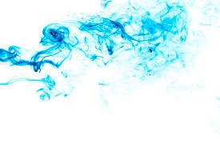

# Optical flow with OpenCV and CUDA

<p align="center">
  
</p>

Processing a static image of a scene has application in different fields of technology and a concrete example has been provided at [Face recognition using OpenCV and CUDA](https://vitalitylearning2021.github.io/faceRecognitionOpenCVCUDA/) with face recognition.  
In the case when a sequence of consecutive images of the same scene are available, acquired by a single or many fixed or moving cameras, it is possible to extract information on the motion of the objects of interest. Indeed, the information contained in the motion covers a role of primary importance in many computer vision problems like the tracking
of moving targets, the temporal prediction of the arrangement of the surrounding environment, the recovery of the three-dimensional velocity field of image points or the segmentation of the image in parts corresponding to moving targets. Moreover, motion information is an indispensable prerequisite for tasks finalized to the movement of
autonomous robots and to their interaction with the environment.  
In this project, we will deal with *optical flow* techniques, namely, with schemes estimating a velocity field from the only intensity of image sequences. However, since the images acquired by a camera convey two-dimensional information, then, by optical flow, it is not possible to reconstruct the full three-dimensional velocity field, but we have to settle for its projection, precisely, on a two-dimensional space. Nonetheless, even a two-dimensional projection of the three-dimensional velocity field brings valuable information in many applications. For the sake of simplicity, we will limit ourselves to the case of a single, still camera.  
More in detail, we will consider four robust, reliable and fast approaches for the accurate estimation of both dense and sparse optical flow: the Farnebäck method, the Brox *et al.* scheme, the Total-Variation-L1 (TV-L1) regularization and the Lucas-Kanade approach. While, in [Face recognition using OpenCV and CUDA](https://vitalitylearning2021.github.io/faceRecognitionOpenCVCUDA/), we used CUDA-accelerated OpenCV routines to set up face recognition along with the help of cuSOLVER, in
this project we will discover how the mentioned techniques are actually already implemented in OpenCV. Nevertheless, although off-the-shelf, the rationale of the dealt with algorithms will be recalled since a conscious use of what is inside any library is always much better than an usage of the same routines as black-boxes. A conscious use of the
libraries indeed enables a consistent definition of the input parameters and a knowledge of the algorithm limitations.  
In the present project, we will deal with:

  - Dense and sparse optical flow;
  - Farnebäck optical flow;
  - Brox *et al.* optical flow;
  - Total-Variation-L1 regularized optical flow;
  - Lucas-Kanade optical flow;
  - Color coding and streamlines drawing for optical flow representation;
  - Optical flow with CUDA-accelerated OpenCV.

## Getting started

In the present project, the key elements of optical flow techniques needed for a conscious use of CUDA-accelerated OpenCV routines will be given. No particular prerequisite is necessary.  
In the next section, we introduce the concepts of optical flow and motion fields.  
The optical flow concept will be qualitatively illustrated starting from its introduction in the field of experimental psychology. Later on, the motion field concept will be quantitatively described as the projection of the three-dimensional velocity field in the image plane. Finally, the relation between optical flow and motion fields will be discussed by highlighting how quantitatively optical flow is an approximation of motion fields

## Optical flow and motion fields

In the present section, we will introduce the concept of optical flow starting from its very origins in the field of applied psychology. The motivation for its introduction provides a valuable example to understand the usefulness of optical flow. Later on, we will more formally describe the concept of motion fields and highlight how quantitatively optical flow is able to provide, in general, only an approximation thereof. We will also point out how, in some remarkable cases, optical flow can lead to misleading conclusions about motion fields.

### The concept of optical flow

The concept of optical flow draws its origin in the field of experimental psychology, that is, in a framework significantly different from that of the technical-engineering applications we are referring to. It was a result of the research of J.J. Gibson which was appointed, during World War II, the task of understanding how pilots fly according to what they see. While studying the perception of moving objects, he introduced the concept of *optical flow* as :

> Optical flow is the distribution of apparent velocities of movement of brightness patterns in an image. Optical flow can arise from the relative motion of objects and the viewer.

To illustrate the concept of optical flow, it is convenient to exploit the same, although dated, three images used by Gibson.  
Figure [1](#flyby) below illustrates the optical flow associated to a flight over a landing field. The arrows describe the motion of the scene points as they appear to the pilot according to the definition above. In particular, the arrows represent the motion direction, through their pointing directions, and the speed, through their lengths, of some scene points.

<p align="center">
  
  <br>
     <em>Figure 1. Flyby optical flow image.</em>
</p>

Figure [1](#flyby) actually illustrates a flyby: the aircraft is passing over the airfield, but it is not landing. We deduce this from the fact that all the arrows point from a position on the horizon and not from the landing area.  
Next figure [2](#landing) displays a landing.

<p align="center">
  
  <br>
     <em>Figure 2. Landing optical flow image.</em>
</p>

Now, the arrows point from a position inside the landing area. When a pilot is landing, the point of the landing area towards which he is moving appears standing still in his field of view. Opposite to that, the other points of the surrounding visual environment move away from such a point.  
Finally, figure [3](#flybyLeft) below represents a flyby to the left.

<p align="center">
  
  <br>
     <em>Figure 3. Flyby to the left.</em>
</p>

It reproduces a scenario in which the pilot is looking to the side and, in particular, over the right shoulder as the plane flies to the left.  
In all the three cases, the vector fields express the optical flow. Notice that the shown images do not mean to faithfully reproduce the *motion field*, i.e., the projections of the velocity vectors of the three-dimensional space into the image plane (a two-dimensional space). Nevertheless, they provide the impression of how movement is occurring.  
According to Gibson, an approximation of the motion field provides the pilot of non-ambiguous information concerning his speed, altitude and direction, namely, a sufficient information to determine the movement of the observer with respect to the surrounding environment.  
In next subsection, we turn to discussing two-dimensional motion fields.

### Two-dimensional motion fields

The two-dimensional motion field problem is illustrated in figure [4](#apertureProblem):

<p align="center">
  
  <br>
     <em>Figure 4. Illustrating the two-dimensional motion fields.</em>
</p>

The above figure illustrates a point  that moves over a certain trajectory  with speed . The motion of  is observed by a point-like camera located at , forming an image of the scene over the plane . Point  must be thought of as one of the many points forming an object moving behind  and of which we isolate  to illustrate the concept of two-dimensional motion fields. For the sake of simplicity, the camera is further assumed to be still, although, in principle, it could be also
dealt with as a moving camera. The plane  represents the focal plane of the camera and, again for simplicity and without losses of generality, it is assumed to coincide with the plane . The point  appears to the camera as being “projected” over  at a point , where

<p align="center">
   [1]
</p>

Point  will move, due to the motion of , with a certain speed . Of course, the -component of  vanishes since
 is constrained to move on .  
As for , there will be many other points on the  plane that will be the images of bodies moving behind  and having a certain velocity . Of course,  will be different from point to point. The collection of all point velocities  is a *two-dimensional motion field*.  
It should be noticed that all the up to now considered quantities , ,  and
 are time-dependent.  
To determine the relation between  and
, let us first observe that

<p align="center">
   [2]
</p>

On taking the time derivative of [\[2\]](#relationPp), we have

<p align="center">
   [3]
</p>

For discussion purposes, eq. [\[3\]](#relationVv) should be regarded as an equation in which  represents the unknown. In other words, we want to determine the velocity field of the points moving behind . The known quantities in eq. [\[3\]](#relationVv) are available at the right-hand side, since we assume to have  available in some way. Unfortunately, eq. [\[3\]](#relationVv) has only two useful components since the projection of both sides on  is the identity . As a consequence, eq. [\[3\]](#relationVv) tells us that, even following an estimate of , we could not be able to estimate the velocities of the points . Therefore, we can conclude that, following the observation of a moving object from a still camera, it is not possible to extract the motion of the scene points. Our only hope is to estimate the velocity field  to have a rough, although incomplete, idea of the motion of the points behind .  
Reinforcing the issue that, from two-dimensional motion field, the actual motion of bodies behind  cannot be deduced, it should be also remarked that an approximation to  is typically provided by what we have defined as optical flow. In next subsection, we underline how the very estimate of motion fields from optical flows can lead to erroneous conclusions in a certain number of canonical cases.

### The slippery relation between optical flows and motion fields

From what illustrated in figures [1](#flyby), [2](#landing) and [3](#flybyLeft), the optical flow can be quantitatively defined as the motion of the brightness pattern of an image. Unfortunately, following such a definition, optical flows do not necessarily coincide with motion fields. In this subsection, we present three classical examples to
convince ourselves of this fact:

1.  the case of a sphere rotating about itself with fixed illumination;
2.  the case of a still sphere illuminated by a moving source;
3.  the Barber’s shop pole.

These three cases should be used as disclaimers on the possibility of consistently using optical flows to estimate motion fields. However, our underlining assumption is that, in many cases and apart from the degenerate ones we will shortly present, we reasonably expect for the sequel that the optical field is close to the motion field.  
Let us now show the first degenerate case.

#### A sphere rotating about itself with fixed illumination

The following figure shows a sphere illuminated by a static source.

<p align="center">
  
  <br>
     <em>Figure 5. Sphere rotating about itself with fixed illumination.</em>
</p>

The source in figure [5](#rotatingSphere) generates a certain light intensity distribution over the sphere. If the sphere rotates about itself, thanks to its symmetry, such shading pattern will not change. As long as the sphere rotates about itself, then, the brightness pattern of its image remains unchanged. Since the optical flow evaluates, as
mentioned, the motion of the brightness pattern, then each point will appear still. The optical flow would lead then to the wrong conclusion that the sphere is motionless.  
It is now the turn of the second degenerate case.

#### A still sphere illuminated by a moving source

Figure [6](#rotatingSource) below shows a sphere this time still, but with a moving source.

<p align="center">
  
  <br>
     <em>Figure 6. Still sphere illuminated by a moving source.</em>
</p>

As long as the source moves, the lighting source changes so that the shading pattern changes and, accordingly, in this case, the optical flow is not zero when the motion field is vanishing. Accordingly, one would erroneously conclude that the sphere is moving while it is not.  
Finally, let us present the last degenerate case.

#### The Barber’s shop pole

The rotating Barber’s pole is the last example in which we show how the optical flow can be a totally erroneous approximation of motion fields. The following figure illustrates the rotating Barber’s shop pole problem.

<p align="center">
  
  <br>
     <em>Figure 7. Rotating Barber’s pole.</em>
</p>

The left side of figure [7](#barbersPole) illustrates the pole: while rotating, the pole’s strips move right. The central side of figure [7](#barbersPole) shows the actual strips motion: the arrows point to the right. However, as it can be understood from the right side of figure [7](#barbersPole), the strips appear moving upwards from one
frame to the next, so that the optical flow represents a totally erroneous estimate of motion field again.  
  
In the just shown examples, we have assumed to be able to compute the optical flow. Even by assuming a full knowledge of the optical flow, we have seen how erroneous conclusions can be reached.  
In the next section, we aim at pointing out the difficulties in the computation of the optical flow.

## The optical flow constraint equation and the aperture problem

The time has become for beginning the discussion on the computation of the optical flow by introducing the *optical flow constraint equation*. We will underline, by illustrating the *aperture problem*, how, strictly speaking, estimating both the components of the velocities of the points in an image is not possible and the consequences of this.  
Let us start with the introduction of the optical flow constraint equation. To this end, let us regard a sequence of images changing in time as they were a movie, by watching at the points altogether. In other words, we adopt what in fluid mechanics is called a *Lagrangian approach*. In this case, the image intensity  depends on both the above introduced space coordinates  and on time . In other words, .  
Let us now change point of view. Let us consider a specific point and follow it through the scene, by getting unconcerned about all the other points. In other words, let us follow the motion  by adopting what, in fluid mechanics, is called *Eulerian approach*. In
this case, we regard the intensity as . Saying it differently, we regard the intensity as a function of time since we are following a point moving along the  trajectory. Now, if the time increases from  to , the point that we are following moves from  to  due to its velocity. In principle, also the intensity of the followed point might change from  to . If we
assume that the intensity of the followed point does not change, namely, we adopt the *constant brightness assumption*, then we have

<p align="center">
   [4]
</p>

On using the chain rule, equation [\[4\]](#constantBrightness) implies that

<p align="center">
   [5]
</p>

Equation [\[5\]](#constantBrightnessExpanded) expresses the so called *optical flow constraint* equation. In such an equation, the partial temporal derivative of  must be considered as a datum since we know the temporal evolution of the images. Analogously,
the partial derivatives of  with respect to  and  must be assumed to be known since we know the individual images. Opposite to that, the components along  and  of  must be considered to be unknown. The question thus arises on whether the optical flow can be estimated under the constant brightness assumption.  
To investigate on whether this is possible, we illustrate the so called *aperture problem* and note that equation [\[5\]](#constantBrightnessExpanded) is a single equation in two unknowns, so that it is under-determined. If we rewrite equation [\[5\]](#constantBrightnessExpanded) as

<p align="center">
   [6]
</p>

then we deduce that it is possible to recover only the component of  along the direction of the gradient  which, as mentioned, is known. In other words, from equation [\[6\]](#normalFlow), we can only determine the so called *normal flow*, i.e., the flow along the direction of the image gradient, but we cannot determine the flow along the tangent direction of the iso-intensity contour, i.e., along the direction perpendicular to the image gradient. This expresses the so called *aperture problem*.  
The aperture problem is illustrated in figures [8](#actualMotion) and [9](#perceivedMotion). In particular, in figure [8](#actualMotion) below, a circular aperture and two blue lines moving in a certain direction are illustrated.

<p align="center">
  
  <br>
     <em>Figure 8. Aperture problem: actual motion of two
lines.</em>
</p>

The circular aperture represents all that is visible in the scene. It should be noticed that, in figure [8](#actualMotion), the blue lines are depicted also outside the circle, but it should be understood that the only observable thing is the portion of the lines within the circle.  
Figure [8](#actualMotion) illustrates the actual motion. Actually, due to the aperture problem, the perceived motion is different and illustrated in figure [9](#perceivedMotion) below.

<p align="center">
  
  <br>
     <em>Figure 9. Aperture problem: perceived motion of two
lines.</em>
</p>

As it can be seen from the above figure and also from figure [8](#actualMotion), the blue lines are the iso-intensity lines and the perceived motion is orthogonal to such lines as predicted by equation [\[6\]](#normalFlow).  
Up to now, we have seen how the motion of the points behind the image plane of a camera can be represented by the motion fields, within certain limits. Moreover, we have underlined how the motion field can be approximated by the optical flow, again within certain limits. Finally, we have pointed out what are the difficulties in the calculation of the optical flow.  
The under-determinacy of the optical flow constraint equation has pushed the literature towards the development of several methods to solve this problem. Some of them will be dealt with in this chapter and will be subject of implementation in OpenCV accelerated with CUDA.  
Before proceeding further with the description of the implemented methods for the optical flow estimate, let us organize the optical flow estimation methods into *dense* and *sparse* methods.

## Dense and sparse optical flow methods

Dense methods process all the pixels of an image, while, in sparse methods, only some pixels are subject of processing. In this case, we only consider the motion of image features like corners, ridges, edges and blobs. As we will see in the following, optical flow methods exploit local pixel information, so that many of them can be used both for dense and sparse optical flow.  
Below, as dense methods, we will consider the Farneb<span>ä</span>ck’s approach, the Brox *et al.* method, the dense iterative Lucas-Kanade method with pyramids and the Zach, Pock and Bischof Dual TV-L1 Optical Flow method . Furthermore, as sparse method, we will consider the implementation for a sparse feature set of the iterative Lucas-Kanade
scheme with pyramids.  
In next section, we start recalling dense optical using Farneb<span>ä</span>ck’s approach.

## Theory: Dense optical flow using Farneb<span>ä</span>ck’s approach

The idea behind Farneb<span>ä</span>ck’s approach  is to approximate an image in a neighborhood of each pixel having indices  with a quadratic polynomial. In other words,

<p align="center">
       [7]
</p>
    
where  is the image,  represents the offset with respect to the  reference pixel, ,  is a  symmetric matrix,  is a vector and  is a scalar. We stress that  does not represent a movement, but only serves to describe a neighborhood of the  pixel in the *same* image .  
In eq. [\[7\]](#farnebackApproximation), ,  and  can be estimated using a weighted least squares approach. Obviously, ,  and  are functions of  since the image could show a different expansion around different pixels. In order to keep notation simple, in the first part of this section, we dismiss the explicit dependence of such quantities on .  
On denoting by  the image acquired immediately after  and by following the same approach of the quadratic expansion around , we have

<p align="center">
       [8]
</p>

where ,  and  have the same meaning of ,  and  in equation [\[7\]](#farnebackApproximation).  
In the case when the neighborhood of the pixel  of  moves rigidly of a quantity  to image , then

<p align="center">
       [9]
</p>

By taking into account relation [\[9\]](#relationHG) as well as expansions [\[7\]](#farnebackApproximation) and [\[8\]](#farnebackApproximationH), then we have the following links

<p align="center">
       [10]
</p>

We skip the details for obtaining [\[10\]](#linksHG). It should be anyway noted that the second equation of [\[10\]](#linksHG) provides the following relation

<p align="center">
       [11]
</p>

where . Solving such an equation will provide the translation  but is possible provided that  is invertible.  
However, it should be taken into account that the translation of the
neighborhood of the pixel \((m,n)\) from \(G\) to \(H\) is not
necessarily ideal and that, accordingly, the links
([\[linksHG\]](#linksHG)) are not necessarily met. In this case, we can
only say, for example, that
\(\underline{\underline{A}}_2\simeq \underline{\underline{A}}_1\). For
this reason, Farneb<span>ä</span>ck rewrites equation
([\[equationInD\]](#equationInD)) by the average of the two matrices,
namely as

\[\label{equationInDRewritten}
\Delta \underline{\underline{A}} \; \underline{d}=\Delta \underline{b},\]

where
\(\Delta \underline{\underline{A}}=0.5(\underline{\underline{A}}_1+\underline{\underline{A}}_2)\).  
As above underlined, matrices \(\underline{\underline{A}}_1\) and
\(\underline{\underline{A}}_2\) as well as the vectors
\(\underline{b}_1\) and \(\underline{b}_2\) depend on the point
\((m,n)\). For this reason, equation
([\[equationInDRewritten\]](#equationInDRewritten)) should be solved
pointwise thus obtaining \(\underline{d}(m,n)\).  
In order to prevent noisy solutions and to provide a smoothing effect,
Farneb<span>ä</span>ck reformulates the search for the solution in
\(\underline{d}\) of equation
([\[equationInDRewritten\]](#equationInDRewritten)) as a least-square
problem by integrating it over a neighborhood of each pixel.
Accordingly, the displacement \(\underline{d}\) is searched for as the
minimum of the functional

\[\label{functionalFarneback}
\sum_{(m^\prime,n^\prime)\in {\mathcal I}(m,n)}w(m^\prime,n^\prime)\|\Delta \underline{\underline{A}}(m^\prime,n^\prime) \; \underline{d}(m,n)-\Delta \underline{b}(m^\prime,n^\prime) \|^2,\]

where \({\mathcal I}(m,n)\) defines a neighborhood of the pixel
\((m,n)\) and \(w\) is a properly chosen window function. In
([\[functionalFarneback\]](#functionalFarneback)), the dependence of
\(\Delta \underline{\underline{A}}\) and \(\Delta \underline{b}\) from
\((m^\prime,n^\prime)\), namely, the pixels of the neighborhood of
\((m,n)\) has been explicitly indicated. For what already said, the
minimization of ([\[functionalFarneback\]](#functionalFarneback)) must
be repeated pixel-by-pixel.  
In next section, we lead the discussion of the Brox *et al.*’s approach.

## Theory: Dense optical flow using Brox *et al.*’s approach

Brox *et al.*’s approach  originates from the observation that the grey
value consistency assumption behind equation
([\[normalFlow\]](#normalFlow)) is not always met and that, as long as
the points move, their respective brightness is susceptible, in natural
scenes, to slight changes. Accordingly, the invariance understood in
equation ([\[constantBrightness\]](#constantBrightness)) is placed side
by side to a further invariance criterion. In particular, the gradient
of the image grey value is assumed not to vary along the displacement.
In other words,

\[\underline{\nabla}I(x,y,t)=\underline{\nabla}I(x+d_x,y+d_y,t+1),\]

where we have assumed that time increases of \(1\) unit from frame to
frame and that \(\underline{d}(x,y)=(d_x(x,y),d_y(x,y))\) is the
displacement of point \((x,y)\).  
The idea of Brox *et al.* consists of searching for
\(\underline{d}(x,y)\) by a least-square minimization. One possibility
would be to minimize the functional

\[E_{data}(d_x,d_y)=\iint_{\Omega(x,y)}\left(|I(x+d_x,y+d_y,t+1)-I(x,y,t)|^2\right.+\ldots\]
\[\label{broxFunctional0}
\;\;\;\;\;\;\;\;\;\;\;\;\;\;\;\;\;\;\;\;\;\;\;\;\;\;\;\;\;\;\;\;\;\;\;\;\;\;\;\;\;\;\;\;\;\;\;\;\;\;\;\;\left.+\gamma|\underline{\nabla}I(x+d_x,y+d_y,t+1)-\underline{\nabla}I(x,y,t)|^2\right)d\Omega,\]

where \(\Omega(x,y)\) represents a neighborhood of point \((x,y)\) and
\(\gamma\) relatively weights both the assumptions and establishes the
trade off between the two enforced invariance conditions. As for the
Farneb<span>ä</span>ck’s approach, the minimization of functional
([\[broxFunctional0\]](#broxFunctional0)) must be performed pointwise.  
In order to reduce the influence of outliers pixels, an increasing
concave function \(\Psi(s)\) is applied leading to

\[E_{data}(d_x,d_y)=\iint_{\Omega(x,y)}\Psi\left(|I(x+d_x,y+d_y,t+1)-I(x,y,t)|^2+\ldots\]
\[\label{broxFunctional1}
\;\;\;\;\;\;\;\;\;\;\;\;\;\;\;\;\;\;\;\;\;\;\;\;\;\;\;\;\;\;\;\;\;\;\;\;\;\;\;\;\;\;\;\;\;\;\;\;\;\;\;\;\gamma|\underline{\nabla}I(x+d_x,y+d_y,t+1)-\underline{\nabla}I(x,y,t)|^2\right)d\Omega.\]

A possible choice for \(\Psi(s)\) is \(\Psi(s)=\sqrt{s^2+\epsilon^2}\),
where \(\epsilon\) is a small constant, for example,
\(\epsilon=0.01\).  
A smoothness condition to account for a piecewise smooth flow field is
also enforced by adding the following smoothing penalizer

\[E_{smooth}(d_x,d_y)=\iint_{\Omega(x,y)}\Psi\left(|\underline{\nabla}_3d_x|^2+|\underline{\nabla}_3d_y|^2\right)d\Omega,\]

where
\(\underline{\nabla}_3=(\partial/\partial x, \partial/\partial y, \partial/\partial t)^t\)
is a spatio-temporal gradient.  
Overall, the following functional is minimized:

\[\label{broxTwoTerms}
E(d_x,d_y)=E_{data}(d_x,d_y)+\alpha E_{smooth}(d_x,d_y),\]

where \(\alpha\) is a *regularization parameter*. Larger values of
\(\alpha\) will lead to smoother solutions.  
The minimizer of ([\[L1Functional3\]](#L1Functional3)) must satisfy the
following Euler-Lagrange equations 

\[\label{eulerLagrange}
\left\{
    \begin{array}{ll}
      \Psi^\prime\left(\Delta I^2+\gamma\left(\Delta I_x^2+\Delta I_y^2\right)\right)\cdot \left(I_x\Delta I+\gamma\left(I_{xx}\Delta I_x+I_{xy}\Delta I_y\right)\right)-\alpha \underline{\nabla} \cdot \left(\Psi^\prime\left(|\underline{\nabla}_3 d_x|^2+|\underline{\nabla}_3 d_y|^2\right)\underline{\nabla}_3d_x\right)=0\\
      \Psi^\prime\left(\Delta I^2+\gamma\left(\Delta I_x^2+\Delta I_y^2\right)\right)\cdot \left(I_y\Delta I+\gamma\left(I_{yy}\Delta I_y+I_{xy}\Delta I_x\right)\right)-\alpha \underline{\nabla} \cdot \left(\Psi^\prime\left(|\underline{\nabla}_3 d_x|^2+|\underline{\nabla}_3 d_y|^2\right)\underline{\nabla}_3d_y\right)=0
       \end{array}
       \right.\]

with reflecting boundary conditions, where

\[\left\{
    \begin{array}{ll}
        I_x=\frac{\partial I}{\partial x}(x+d_x,y+d_y) & I_y=\frac{\partial I}{\partial y}(x+d_x,y+d_y)\\
        I_{xx}=\frac{\partial ^2I}{\partial x^2}(x+d_x,y+d_y) & I_{yy}=\frac{\partial ^2I}{\partial y^2}(x+d_x,y+d_y)\\
        \Delta I=I(x+d_x,y+d_y)-I(x,y) & I_{xy}=\frac{\partial ^2 I}{\partial x\partial y}(x+d_x,y+d_y) \\
        \Delta I_x=\frac{\partial I}{\partial x}(x+d_x,y+d_y)-\frac{\partial I}{\partial x}(x,y) & \Delta I_y=\frac{\partial I}{\partial y}(x+d_x,y+d_y)-\frac{\partial I}{\partial y}(x,y)
                \end{array}
              \right..\]

Equations ([\[eulerLagrange\]](#eulerLagrange)) are highly non-linear
and can be solved by fixed point iterations. In other words, letting
\((d_x^k,d_y^k)\) the unknown value at the \(k\)-th iterations, the
first equation of ([\[eulerLagrange\]](#eulerLagrange)) is rewritten as

\[0=A^k\cdot\left(I_x^k\left(\Delta I^k+I_x^kdu^k+I_y^kdv^k\right) \right)+\gamma A^k\left(I_{xx}^k\left(\Delta I_x^k+I_{xx}^kdu^k+I_{xy}^kdv^k\right)+\right.\]
\[\label{fixedPoint}
\;\;\;\;\;\;\;\;\;\;\;\;\;\;\;\;\;\;\;\;\;\;\;\;\;\;\;\;\left.I_{xy}^k\left(\Delta I_y^k+I_{xy}^kdu^k+I_{yy}^kdv^k\right)\right)-\alpha \underline{\nabla}\cdot\left(B^k\underline{\nabla}_3\left(d_x^k+du^k\right)\right),\]

where

\[A^k=\Psi^\prime\left(\left(\Delta I^k+I_x^kdu^k+I_y^kdv^k\right)^2+\gamma\left(\left(\Delta I_x^k+I_{xx}^kdu^k+I_{xy}^kdv^k\right)^2+\left(\Delta I_y^k+I_{xy}^kdu^k+I_{yy}^kdv^k\right)^2\right)\right),\]

\[B^k=\Psi^\prime\left(|\underline{\nabla}_3\left(d_x^k+du^k\right)|^2+|\underline{\nabla}_3\left(d_y^k+dv^k\right)|^2\right)\]

and \(du^k\) and \(dv^k\) are the updates for \(d_x^k\) and \(d_y^k\),
respectively. The second equation of
([\[eulerLagrange\]](#eulerLagrange)) can be written similarly.  
Unfortunately, equation ([\[fixedPoint\]](#fixedPoint)) is still
non-linear in \(du^k\) and \(dv^k\) since such variables are contained
also in \(A^k\) and \(B^k\). In order to remove the remaining
non-linearity, a second, inner, fixed point iteration is operated. In
particular, on denoting by \(A^{k,l}\), \(B^{k,l}\), \(du^{k,l}\) and
\(dv^{k,l}\) the values of the corresponding variables at the \(l\)-th
inner iteration, then equation ([\[fixedPoint\]](#fixedPoint)) is
rewritten as:

\[0=A^{k,l}\cdot\left(I_x^k\left(\Delta I^k+I_x^kdu^{k,l+1}+I_y^kdv^{k,l+1}\right) \right)+\gamma A^{k,l}\left(I_{xx}^k\left(\Delta I_x^k+I_{xx}^kdu^{k,l+1}+I_{xy}^kdv^{k,l+1}\right)+\right.\]
\[\label{fixedPoint2}
\;\;\;\;\;\;\;\;\;\;\;\;\;\;\;\;\;\;\;\;\;\;\;\;\;\;\;\;\left.I_{xy}^k\left(\Delta I_y^k+I_{xy}^kdu^{k,l+1}+I_{yy}^kdv^{k,l+1}\right)\right)-\alpha \underline{\nabla}\cdot\left(B^{k,l}\underline{\nabla}_3\left(d_x^k+du^{k,l+1}\right)\right),\]

so that, keeping \(A^{k,l}\) and \(B^{k,l}\) fixed at the \(l\)-th inner
iteration, the equation is now linear in \(du^{k,l+1}\) and
\(dv^{k,l+1}\). Equation ([\[fixedPoint2\]](#fixedPoint2)), along with
its non-written companion, form a linear system of equations in
\(du^{k,l+1}\) and \(dv^{k,l+1}\) which can be solved by a standard
iterative method.

## Theory: Dense optical flow using TV-L1 regularization

We have already underlined that equation ([\[normalFlow\]](#normalFlow))
is under-determined, being a single equation in two unknowns. In order
to solve it, the approach by Horn and Schunck , which has been much
popular for a while, consists of placing a smoothness condition
enforcing the displacement \(\underline{d}(x,y)\) to be regular side by
side to equation ([\[normalFlow\]](#normalFlow)). In particular, the
Horn and Schunck’s approach determined \(\underline{d}(x,y)\) by the
minimization of the following functional:

\[\label{L1Functional1}
E_{HS}(d_x,d_y)=\iint_{\Omega(x,y)}\left(\left(\underline{\nabla}I\cdot \underline{d}+\frac{\partial I}{\partial t}\right)^2+\alpha\left(|\underline{\nabla}d_x(x,y)|^2+|\underline{\nabla}d_y(x,y)|^2\right)^2\right)d\Omega,\]

where \(\Omega(x,y)\) represents again a neighborhood of \((x,y)\) and
\(\alpha\), like \(\gamma\) for the Brox *et al.*’s approach, weights
both the assumptions.  
If we replace the first term of ([\[L1Functional1\]](#L1Functional1))
with \(I(x+d_x(x,y),y+d_y(x,t),t+1)-I(x,y,t)\), we have the following
modified version of the functional to be minimized :

\[\label{L1Functional2}
  E_{HS}(d_x,d_y)=\left(\iint_{\Omega(x,y)}\left(\rho(x,y,d_x,d_y)\right)^2+\alpha\left(|\underline{\nabla}d_x(x,y)|^2+|\underline{\nabla}d_y(x,y)|^2\right)\right)d\Omega,\]

with

\[\rho(x,y,d_x,d_y)=I(x+d_x(x,y),y+d_y(x,y),t+1)-I(x,y,t).\]

The term \(I(x+d_x(x,y),y+d_y(x,y),t+1)\) is non-linear in \((d_x,d_y)\)
and is typically linearized using Taylor expansion leading to

\[\rho(x,y,d_x,d_y)=\underline{\nabla}I(x+d_x^0(x,y),y+d_y^0(x,y),t+1)\cdot \left(\left(d_x(x,y),d_y(x,y)\right)\right)-\left(d_x^0(x,y),d_y^0(x,y)\right)\right)+\ldots\]
\[\label{rhoFunctionTVL1}
\;\;\;\;\;\;\;\;\;\;\;\;\;\;\;\;\;\;\;\;\;\;\;\;\;\;\;\;\;\;\;\;\;\;\;\;\;\;+I(x+d_x^0(x,y),y+d_y^0(x,y),t+1)-I(x,y,t),\]

where \((d_x^0(x,y),d_y^0(x,y))\) is an approximation to
\((d_x(x,y),d_y(x,y))\).  
Nevertheless, to allow discontinuities in the flow field, references 
propose to minimize the following functional:

\[\label{L1Functional3}
  E(d_x,d_y)=\iint_{\Omega(x,y)}\left(\lambda|\rho(x,y,d_x,d_y)|+\left(|\underline{\nabla}d_x(x,y)|+|\underline{\nabla}d_y(x,y)|\right)\right)d\Omega.\]

As it can be seen, the new functional does not contain squares and, as a
matter of fact, contains a \(L^1\) data penalty term. A penalization
like this is known as *total variation regularization*. Further details
on total variation regularization can be found in .  
A way to minimize functional ([\[L1Functional3\]](#L1Functional3)) is to
introduce the following convex relaxation problem

\[\label{L1FunctionalRelaxation}
  E_\theta(d_x,d_y)=\iint_{\Omega(x,y)}\lambda|\rho(x,y,v_x,v_y)|+\left(|\underline{\nabla}d_x(x,y)|+|\underline{\nabla}d_y(x,y)|\right)+\frac{1}{2\theta}|(d_x,d_y)-(v_x,v_y)|^2d\Omega.\]

Such functional can be optimized by performing alternate minimizations
against \((d_x,d_y)\) for a fixed \((v_x,v_y)\) and against
\((v_x,v_y)\) for a fixed \((d_x,d_y)\). In other words,

1.  for fixed \((v_x,v_y)\), \[\label{func1TVL1}
          \iint_{\Omega(x,y)}\left(|\underline{\nabla}d_x(x,y)|+|\underline{\nabla}d_y(x,y)|\right)+\frac{1}{2\theta}|(d_x,d_y)-(v_x,v_y)|^2d\Omega;\]
    is minimized;

2.  for fixed \((d_x,d_y)\), \[\label{func1TVL2}
          \iint_{\Omega(x,y)}\frac{1}{2\theta}|(d_x,d_y)-(v_x,v_y)|^2+\lambda|\rho(x,y,v_x,v_y)|d\Omega.\]
    is minimized.

Concerning the minimization of functionals ([\[func1TVL1\]](#func1TVL1))
and ([\[func1TVL2\]](#func1TVL2)):

1.  functional ([\[func1TVL1\]](#func1TVL1)) is minimized by using the
    following iterations
    
    \[\label{timeStepTVL1}
    \underline{p}_s^{k+1}=\frac{\underline{p}_s^{k}+(\tau/\theta)\underline{\nabla}(v_s^{k+1}+\theta\underline{\nabla}\cdot \underline{p}_s^k)}{1+(\tau/\theta)|\underline{\nabla}(v_s^{k+1}+\theta \underline{\nabla}\cdot \underline{p}_s^k)|},\;\;\;\; s=x,y,\]
    
    where \(\tau\) is the time step , and performing the unknown update
    as
    
    \[d_s^{k+1}=v_s^{k+1}+\theta \underline{\nabla}\cdot \underline{p}_s^k, \;\;\;\; s=x,y;\]

2.  functional ([\[func1TVL2\]](#func1TVL2)) is minimized using the
    following iterations
    
    \[\underline{v}^{k+1}=\underline{d}^{k+1}+TH(\underline{d}^{k+1},\underline{d}^0),\]
    
    dove \(TH(\cdot,\cdot)\) is a thresholding operator whose details
    are reported in .

The above alternate minimization proceeds by the *warping* technique. In
other words, the alternate minimization is repeated a certain number of
times and, each time it is completed, the value of \(\underline{d}^0\)
is updated and, consequently, also the values of
\(I(x+d_x^0(x,y),y+d_y^0(x,y),t+1)\) and
\(\underline{\nabla}I(x+d_x^0(x,y),y+d_y^0(x,y),t+1)\) are updated. The
number of warpings is a parameter that assures the stability of the
method. It affects the running time and establishes a compromise between
speed and accuracy.  
The iterations stop when the norm of the difference between
\((d_x(x,y),d_y(x,y))\) at the current iteration and
\((d_x(x,y),d_y(x,y))\) at the previous iteration is less than a
constant \(\epsilon\). \(\epsilon\) is a trade-off between precision and
running time. A small value yields more accurate solutions at the
expense of a slower convergence.  
Functional ([\[L1Functional3\]](#L1Functional3)) can be rewritten by
adding a third component to the \(\underline{d}=(d_x,d_y)\) vector,
namely, regarding it as \(\underline{d}=(d_x,d_y,d_z)\) and regarding
the images as functions of \((x,y,z)\) instead of \((x,y)\) . This
requires, for the evaluation of the gradient in
([\[rhoFunctionTVL1\]](#rhoFunctionTVL1)), the definition of the
derivative of \(I\) with respect to the new coordinate \(z\). Such a
derivative is conventionally set to \(\gamma\). The added third
dimension is conceived as a brightness variation term. In this way, an
extra degree of freedom that allows for brightness changes that are not
due to image movement is allowed. The inclusion of these brightness
changes in the smoothness term, namely
\(|\underline{\nabla}d_x|+|\underline{\nabla}d_y|+|\underline{\nabla}d_z|\),
penalises high frequency brightness changes between frames.

## Theory: Dense and sparse optical flows using Lucas-Kanade’s approach

The Lucas-Kanade algorithm  was originally proposed in 1981 for dense
processing. However, it can be easily applied in a sparse context since,
coherently with what above said, it uses only local image information
through the exploitation of a small window surrounding each point of
interest. Accordingly, it has become also an important sparse technique.
In the examples that will follow, we will see Lucas-Kanade’s approach at
work both for dense and sparse applications.  
Lucas-Kanade’s approach relies on equation
([\[normalFlow\]](#normalFlow)). However, as we have already said, being
dealt with pixelwise, such equation has two unknowns and consequently it
is not uniquely solvable. For this reason, the approach uses a spatial
coherence assumption to solve this problem, namely, neighboring points
in a scene belong to the same surface, have similar motion, and project
to nearby points on the image plane.  
In other words, by considering a pixel window around a certain pixel of
interest, equation ([\[normalFlow\]](#normalFlow)) is transformed to

\[\label{lucasKanade}
\underbrace{\begin{bmatrix}
I_x(m_1, n_1) & I_y(m_1, n_1)\\
I_x(m_2, n_2) & I_y(m_2, n_2)\\
\ldots & \ldots\\
I_x(m_{25}, n_{25}) & I_y(m_{25}, n_{25})
\end{bmatrix}}_{\underline{\underline{A}}}\;
\underbrace{\begin{bmatrix}
v_x\\
v_y
\end{bmatrix}}_{\underline{v}}\;=-
\underbrace{\begin{bmatrix}
I_t(m_1,n_1)\\
I_t(m_2,n_2)\\
\ldots\\
I_t(m_{25}, n_{25})
\end{bmatrix}}_{\underline{b}},\]

where \(I_x\) and \(I_y\) are the spatial derivatives of \(I\) along and
\(x\) and \(y\), respectively, \(I_t\) is its temporal derivative and
\((m_1,n_1),\ldots,(m_{25}, n_{25})\) are the pixels inside the
\(5\times 5\) window. Equation ([\[lucasKanade\]](#lucasKanade))
expresses the fact that the \(x\) and \(y\) components of the pixel
velocity are assumed to be constant within the considered \(5\times 5\)
window. While equation ([\[normalFlow\]](#normalFlow)) was an
undetermined system of one equation in two unknowns, now equation
([\[lucasKanade\]](#lucasKanade)) is, in our example, an overconstrained
system of in two unknowns. A least-squares solution to it can be
obtained as the minimum of the functional:

\[\label{lucasKanadeFunctional}
\|\underline{\underline{A}}\;\underline{v}-\underline{b}\|^2.\]

The solution to ([\[lucasKanadeFunctional\]](#lucasKanadeFunctional))
can be written as:

\[\underline{v}=\left(\underline{\underline{A}}^t\underline{\underline{A}}\right)^{-1}\underline{\underline{A}}^t\;\underline{b}.\]

Obviously, to define a meaningful solution,
\(\left(\underline{\underline{A}}^t\underline{\underline{A}}\right)\)
must be invertible and this typically occurs at the corners of the
image. We will discuss below how spotting the image positions where
\(\left(\underline{\underline{A}}^t\underline{\underline{A}}\right)\)
exhibits the best properties to be invertible and then where applying
the Lucas-Kanade algorithm.  
An issue arising in the previously described approaches, both for dense
and sparse applications, is the difficulty in following a fast point
motion from an image to the next. In the following section, we will
illustrate a strategy, namely, the *pyramids approach*, capable to
mitigate such a limitation.

## The pyramids approach

The up to here recalled schemes make an explicit or implicit use of
window functions to isolate the neighborhood of the point around which
we want to compute the displacement. We indeed recall that
Farneb<span>ä</span>ck’s approach has been presented using a window
function \(w\) while Brox *et al.*’s approach, the approach using TV-L1
regularization and the Lucas-Kanade’s method use, as a matter of fact,
rectangular windows. In principle, the windows should have very small
support so to favor resolution. Unfortunately, the disadvantage of using
small local windows in the above-described methods is that large motions
can move points outside of the local window when passing from an image
to the next. In such a case, recovering the motion would be impossible.
This problem led to development of “pyramidal” algorithms . Such
algorithms perform the tracking starting from the top of the pyramid and
using a window with large support leading to coarse resolution. Then,
they improve the resolution by traversing the pyramid to its bottom and
using even narrower windows. Tracking over image pyramids then allows
large motions to be caught by local windows.  
Let us now attempt to better explain the above exposed concepts.  
An important assumption of the optical flow algorithms we have presented
is the *temporal persistence* or *small movements* assumption. In other
words, the temporal increments from frame to frame are small enough that
the objects do not move much from one frame to the next. Another
important assumption is the *spatial coherence* one. According to it,
neighboring points in a scene belong to the same surface, have similar
motion, and project to nearby points on the image plane.  
However, sometimes, due to camera limitations, objects move at high
speed and, to catch them across frames, we need large windows.
Unfortunately, this may break the spatial coherence assumption.  
To counteract this issue, the pyramids approach we will now going to
sketch is used. Using pyramids, a first approximation of large motions
is estimated by the same involved images, but with reduced resolution.
This rough estimation is refined, in subsequent steps, by increasing the
images resolution from coarse to high. This not only improves the
accuracy, but reduces also the computational complexity .  
To illustrate the pyramids approach, let \(G(m,n)\) and \(H(m,n)\) be
two two-dimensional, \(M\times N\) sized grey scaled images defined, for
simplicity, over a continuous two-dimensional domain of \((m,n)\)
points, with \(m=0,\ldots,M-1\) and \(n=0,\ldots,N-1\).  
Let us now consider an image point \((m,n)\) of \(G\). The goal of the
tracking is to find the location \((m,n)=(m+d_m,n+d_n)\) on \(H\) such
that \(G(m,n)\) and \(H(m+d_m,n+d_n)\) are “similar”. The vector
\((d_m,d_n)\) is thus a measure of the velocity of a point at \((m,n)\),
namely, of the optical flow at \((m,n)\). The notion of similarity is to
be understood in a two-dimensional neighborhood sense which, in turn,
requires the introduction of a proper integration window. If \(B_m\) and
\(B_n\) are two integers defining a window size, then \((d_m,d_n)\) can
be defined as the vector that minimizes the residual function

\[\epsilon(d_m,d_n)=\sum_{m^\prime=m-B_m}^{m+B_m}\sum_{n^\prime=n-B_n}^{n+B_n}\left(G(m^\prime,n^\prime)-H(m^\prime+d_m,n^\prime+d_n)\right)^2\]

In other words, the similarity at hand is measured using an image
neighborhood of size \((2B_m+1)\times (2B_n+1)\). Typical values for
\(B_m\) and \(B_n\) are from \(2\) to \(7\) pixels.  
Intuitively, and as above underlined, the integration window size,
defined by \(B_m\) and \(B_n\), should be small not to “smooth out” the
image details. Opposite to that, it should be large, as above mentioned,
to handle large motions. The trade-off between small and large window
sizes can be dealt with by using a pyramidal approach.  
Let us then now define the pyramid representation of \(G\). Let
\(G^{(0)}=G\) be the “zero-th” level image, namely, the raw image or the
highest resolution image. In a word, \(G\) itself. \(G^{(0)}\) of course
has size \(M^{(0)}\times N^{(0)}=M\times N\). The pyramid technique
proceeds iteratively: compute \(G^{(1)}\) from \(G^{(0)}\), then compute
\(G^{(2)}\) from \(G^{(1)}\), etc. Generally speaking, if \(l\) is a
generic pyramidal level, then \(G^{(l)}\) is the
\(M^{(l)}\times N^{(l)}\) image at level \(l\) which is obtained by
\(G^{(l-1)}\) as

\[G^{(l)}(m,n)=\frac{1}{4}G^{(l-1)}(2m,2n)+\ldots\]
\[\frac{1}{8}\left(G^{(l-1)}(2m-1,2n)+G^{(l-1)}(2m+1,2n)+G^{(l-1)}(2m,2n-1)+G^{(l-1)}(2m,2n+1)\right)+\ldots\]
\[\label{pyramidsEquation}
\frac{1}{16}\left(G^{(l-1)}(2m-1,2n-1)+G^{(l-1)}(2m+1,2n+1)+G^{(l-1)}(2m-1,2n+1)+G^{(l-1)}(2m+1,2n-1)\right).\]

The pyramids approach is illustrated in the next figure:
[1.10](#pyramidsApproach).


Notice that the transformation from \(G^{(l-1)}\) to \(G^{(l)}\) is a
low-pass filtering which leads to a smoothing of the image at the upper
level.  
Notice also that, in equation
([\[pyramidsEquation\]](#pyramidsEquation)), the image at level \(l\) is
formed from the image at level \(l-1\) by accessing \(G^{(l-1)}\)
essentially with the index \((2m,2n)\), apart from \(\pm 1\) shifts.
Therefore, being \(M^{(l-1)}\times N^{(l-1)}\) the image dimensions of
\(G^{(l-1)}\), the following conditions must be met:

\[\label{pyramidsConditions}
\left\{
                \begin{array}{ll}
                  0\leq 2m\leq M^{(l-1)}-1\\
                  0\leq 2n\leq N^{(l-1)}-1
                \end{array}
              \right..\]

However, the \(\pm 1\) requires to break through the actual size of
\(G^{(l-1)}\), so that proper boundary conditions must be enforced. A
typical possibility is:

\[\left\{
                \begin{array}{ll}
                  G^{(l)}(-1,n) & = G^{(l)}(0,n)\\
                  G^{(l)}(m,-1) & = G^{(l)}(m,0)\\
                  G^{(l)}(M^{(l)},n) & = G^{(l)}(M^{(l)}-1,n)\\
                  G^{(l)}(m,N^{(l)}) & = G^{(l)}(m,N^{(l)}-1)\\
                  G^{(l)}(M^{(l)},N^{(l)}) & = G^{(l)}(M^{(l)}-1,N^{(l)}-1)
                \end{array}
              \right..\]

On substituting the maximum values of the \(m\) and \(n\) coordinates
for \(G^{(l-1)}\) in equation
([\[pyramidsConditions\]](#pyramidsConditions)), then we have:

\[\left\{
                \begin{array}{ll}
                  M^{(l)}\leq \frac{M^{(l-1)}+1}{2}\\
                  N^{(l)}\leq \frac{N^{(l-1)}+1}{2}\\
                \end{array}
              \right.,\]

which constraints the maximum dimensions of \(G^{(l)}\) as a function of
the maximum dimensions of \(G^{(l-1)}\).  
The maximum level \(L\) is the pyramid height and is chosen with a
degree of arbitrarity. Typical values are \(2\), \(3\) and \(4\) and,
for practical image dimensions, there is no point into having \(L>4\)
since, rising up the pyramid, the dimensions of the image are halved
from level to level. Furthermore, since the main reason of using the
pyramid technique is to be able to handle large pixel movements, and, in
particular, larger than \((d_m,d_n)\), then \(L\) should also be chosen
according to the maximum expected image flow. Since our focus will be on
OpenCV with CUDA implementation below, then we skip further details on
this point.  
It is now time to discuss how the pyramid can be used within an optical
flow algorithm. In particular, we describe the traversal of the pyramid
from level \(l\) to level \(l-1\). On assuming that the processing at
level \(l\) has been completed, we have at our disposal an estimate
\((d_m^{(l)},d_n^{(l)})\) of the optical flow. Such an estimate can be
used as a starting guess of the optical flow at level \(l-1\). More in
detail, the starting guess at level \(l-1\) is constructed as

\[\label{pyramidGuess}
(d_{m_g}^{(l-1)},d_{n_g}^{(l-1)})=2(d_m^{(l)},d_n^{(l)}).\]

In equation ([\[pyramidGuess\]](#pyramidGuess)), we have exploited the
relation between the image indices of levels \(l-1\) and \(l\), while
the subscript \(g\) stands for *guess*. The new estimate
\((d_{m}^{(l-1)},d_{n}^{(l-1)})\) is achieved by minimizing the
following functional

\[\epsilon(d_{m_\delta}^{(l-1)},d_{n_\delta}^{(l-1)})=\sum_{m^\prime=m-B_m}^{m+B_m}\sum_{n^\prime=n-B_n}^{n+B_n}\left(G^{(l-1)}(m^\prime,n^\prime)-H^{(l-1)}(m^\prime+d_{m_\delta}^{(l-1)}+d_{m_g}^{(l-1)},n^\prime+d_{n_\delta}^{(l-1)}+d_{n_g}^{(l-1)})\right)^2\]

against the variable \((d_{m_\delta}^{(l-1)},d_{n_\delta}^{(l-1)})\) for
a fixed value of \((d_{m_g}^{(l-1)},d_{n_g}^{(l-1)})\). It should be
noticed that the size \((2B_m+1)\times(2B_n+1)\) is independent on
\(l\).

## Corner finding

As already mentioned, dense optical flow techniques apply to all the
pixels in an image, but sparse approaches apply only to pixels showing
specific “features”. For this reason, when applying sparse methods, it
is necessary in advance to look for specific features or patterns which
can be easily tracked . But what are these features?  
In order to understand what are the so-called *good features to track*,
let us consider figure [1.11](#featureToTrack) in which a large image
formed by a simple green rectangle is shown.


Next to the rectangle, three possible features to track are depicted,
namely, features \(A\), \(B\) and \(C\).  
Let us now suppose that we are appointed to spot the position of box
\(A\) within the left image of figure [1.11](#featureToTrack). Box \(A\)
represents the first feature whose tracking feasibility we are going to
investigate. It appears that we would be in a serious trouble in
spotting the position of box \(A\) since there would be infinite, better
\(\infty^2\), possible solutions obtainable by moving the grey frame of
box \(A\) to the left or to the right, up or down within the green patch
of figure [1.11](#featureToTrack). This occurs because the gray frame of
box \(A\) would produce “no gradient” when moving within the large green
patch. Producing no gradient gives then rise to tracking ambiguities.  
Let us now evaluate the possibility of tracking box \(B\) representing
an edge. In this case, the range of solutions reduces from \(\infty^2\)
to \(\infty\) since an ambiguity is obtained only by moving the search
box to the left or to the right. The blue frame around box \(B\) has
gradient moving up or down but, this notwithstanding, localization is
still not uniquely possible.  
Finally, let us consider the tracking of box \(C\) representing a
corner. In this case, no ambiguity would appear and we would drop the
solutions from \(\infty\) to \(1\). Indeed, there is only one position
for the red frame to exactly represent box \(C\) over the large green
patch. The red frame would show gradient either moving left-right or
moving up-down. Corners are thus good features to track since they are
uniquely spottable within an image.  
But, how do we find corners in an image? That is, how can we operate the
so called *feature detection*?  
Intuitively, following what above illustrated with the aid of figure
[1.11](#featureToTrack), we should look for the image regions which have
maximum variation when moved, by a small amount, in all directions
around.  
Once spotted the “good” features within the image, the last question to
answer is: how can we find the same features in the next image? This
task requires the capability of adequately describing the found features
so that they can be spotted also in the next image, a step known as
*feature description*.  
In the two next subsections, we recall two among the most successful
corner detectors, namely, Harris and Shi-Tomasi corner detectors.

### Harris corner detector

One of the first corner detection algorithms has been Harris corner
detector developed by Harris and Stephens in 1988 .  
To illustrate it, let us consider, without loss of generality, a grey
scale, two-dimensional image \(I\). Moreover, let us suppose to divide
the image in many small patches. Let us consider one of the various
patches covering the image, say \(W\), and let us consider also its
version shifted of an offset \((d_x,d_y)\). Finally, let us consider the
functional composed by the squared sums of the differences of the two
patches (original and shifted), namely

\[\label{functionalHarris}
E(d_x,d_y)=\sum_{(x,y)\in W} \left(I(x,y)-I(x+d_x,y+d_y)\right)^2.\]

In ([\[functionalHarris\]](#functionalHarris)), the summation terms
could in principle be weighted by the values of a proper window
function, but this point has been here skipped for the sake of
simplicity.  
For patches where the image is nearly constant, then the quantity
\(\left(I(x,y)-I(x+d_x,y+d_y)\right)\) is close to vanishing. Opposite
to that, for patches where the image has significant changes and that
potentially contain an edge, such difference is larger. Accordingly, and
following the discussion involving figure [1.11](#featureToTrack), we
need to search for the patches where \(E(d_x,d_y)\) is large.  
To this end, on expanding the quantity \(I(x+d_x,y+d_y)\) in a Taylor
series for a small shift \((d_x,d_y)\), then we have

\[\label{harrisTaylor}
I(x+d_x,y+d_y)\simeq I(x,y)+I_x(x,y)d_x+I_y(x,y)d_y,\]

where \(I_x\) and \(I_y\) are the partial derivatives of \(I\). On
substituting equation ([\[harrisTaylor\]](#harrisTaylor)) in
([\[functionalHarris\]](#functionalHarris)), we finally have

\[\label{functionalHarris2}
E(d_x,d_y)\simeq \sum_{(x,y)\in W}\left(I_x(x,y)d_x+I_y(x,y)d_y\right)^.\]

Functional ([\[functionalHarris2\]](#functionalHarris2)) can be
conveniently rewritten as

\[E(d_x,d_y)\simeq \begin{bmatrix}
d_x & d_y
\end{bmatrix}\; \underline{\underline{M}}\; \begin{bmatrix}
d_x \\ d_y
\end{bmatrix},\]

where

\[\label{cornerMatrix}
\underline{\underline{M}}=\sum_{(x,y)\in W} \begin{bmatrix}
I_x^2 & I_x I_y\\ I_xI_y & I_y^2
\end{bmatrix}\;= \; \begin{bmatrix}
\sum_{(x,y)\in W} I_x^2 & \sum_{(x,y)\in W} I_x I_y\\ \sum_{(x,y)\in W} I_xI_y & \sum_{(x,y)\in W} I_y^2
\end{bmatrix}.\]

The so-obtained matrix \(\underline{\underline{M}}\) is symmetric and
positive, semi-definite, so that it can be decomposed by the SVD as

\[\underline{\underline{M}}=\underline{\underline{U}}\; \begin{bmatrix}
\sigma_1 & 0\\ 0 & \sigma_2
\end{bmatrix} \;\underline{\underline{U}}^t,\]

where \(\sigma_1\) and \(\sigma_2\) are singular values. The SVD has
been already used in the previous chapter to implement face
recognition.  
The shift \(\begin{bmatrix}d_x & d_y \end{bmatrix}^t\) can be then
rewritten by the basis vectors forming the columns of
\(\underline{\underline{U}}\), namely, as

\[\label{harrisShiftExpansion}
\begin{bmatrix}d_x & d_y \end{bmatrix}^t = \underline{\underline{U}}\;\underline{a}=a_1 \underline{u}_1+a_2\underline{u}_2,\]

where \(\underline{u}_1\) and \(\underline{u}_2\) are the columns of
\(\underline{\underline{U}}\) and \(a_1\) and \(a_2\) are the components
of \(\begin{bmatrix}d_x & d_y \end{bmatrix}^t\) along the basis offered
by \(\underline{u}_1\) and \(\underline{u}_2\). Following equation
([\[harrisShiftExpansion\]](#harrisShiftExpansion)), we have

\[\label{harrisShiftExpansionFinal}
    E(d_x,d_y)=\sigma_1 a_1^2+\sigma_2 a_2^2.\]

According to the geometric interpretation of the SVD , equation
([\[harrisShiftExpansionFinal\]](#harrisShiftExpansionFinal)) says that:

1.  When \(\sigma_1 \gg 0\) and \(\sigma_2\simeq 0\), then we have a
    strong variation of the image intensity along \(\underline{u}_1\)
    and a small variation of the image intensity along
    \(\underline{u}_2\) within the patch \(W\). This means that \(W\)
    contains an edge in the direction orthogonal to \(\underline{u}_1\).
    Similarly, when \(\sigma_1 \simeq 0\) and \(\sigma_2 \gg 0\), then
    \(W\) contains an edge in the direction orthogonal to
    \(\underline{u}_2\).

2.  When \(\sigma_1 \gg 0\) and \(\sigma_2 \gg 0\), then within the
    patch \(W\) we have a strong variation of the image intensity both
    along \(\underline{u}_1\) and \(\underline{u}_2\). This means that
    \(W\) contains a corner.

3.  If \(\sigma_1 \simeq 0\) and \(\sigma_2 \simeq 0\), then \(W\)
    contains neither an edge nor a corner.

The computation of the SVD of \(\underline{\underline{M}}\) should be
performed for each patch in which the image is divided. This can be
computationally burdened. Therefore, instead of computing the full SVD,
the possibility of using a less burdened and faster to be computed
indicator is explored. Typically, the following indicator can be used

\[\label{harrisParameter}
    R=\det{\underline{\underline{M}}}-k\left(\Tr{\underline{\underline{M}}}\right)^2,\]

where \(\det{\cdot}\) indicates the determinant of a matrix,
\(\Tr{\cdot}\) is its trace and \(k\) is an empirically determined
constant typically belonging to \([0.04, 0.06]\). The following
equalities hold

\[\Tr{\underline{\underline{M}}}=\sigma_1+\sigma_2\]

and

\[\det{\underline{\underline{M}}}=\sigma_1\sigma_2.\]

Accordingly:

1.  If \(|R|\) is small, which occurs when \(\sigma_1\) and \(\sigma_2\)
    are small, the patch contains neither a corner, nor an edge.

2.  If \(R<0\), which occurs when \(\sigma_1 \gg \sigma_2\) or vice
    versa, the patch contains an edge.

3.  if \(R\) is large, which happens when \(\sigma_1\) and \(\sigma_2\)
    are large and \(\sigma_1\simeq \sigma_2\), the patch contains a
    corner.

The three above possibilities are represented in a nice picture as
follows:


In figure [1.12](#harrisCorner), the plane of the singular values is
represented. For what above said, the top-left region spots an edge in
the direction orthogonal to \(\underline{u}_2\), while the bottom-right
region an edge in the direction orthogonal to \(\underline{u}_1\). The
region around the origin is “flat” in the sense that it represents
neither corners, nor edges. The portion of plane around the bisector
corresponds to the case when both \(\sigma_1\) and \(\sigma_2\) are
significant and so the patch has variations both along
\(\underline{u}_1\) and \(\underline{u}_2\) which corresponds to a
corner.  
In next section, we will shortly describe the Shi-Tomasi corner
detector, namely, another corner detector often used in applications
and, in particular, in the applications of interest of this chapter.

### Shi-Tomasi corner detector

Shi and Tomasi corner detector  works along the same line as that for
Harris corner detector seen above, but uses a modified indicator.
Instead of exploiting ([\[harrisParameter\]](#harrisParameter)), Shi and
Tomasi proposed using

\[R=\min(\sigma_1,\sigma_2).\]

If \(R\) is greater than a certain threshold, the patch is considered to
host a corner. As for the Harris corner detector, also Shi and Tomasi
corner detector can be illustrated by a graph. If we use again the
\((\sigma_1,\sigma_2)\) plane as we have done for Harris corner
detector, we get the image in the figure [1.13](#shiTomasiCorner):


From the above figure, it can be seen that only when \(\sigma_1\) and
\(\sigma_2\) are above a minimum value \(\sigma_{\min}\), the patch is
considered hosting a corner. The corner region is the green region in
figure [1.13](#shiTomasiCorner).  
Under certain assumptions, the corner detected by the Shi-Tomasi corner
detector are more stable for tracking than the Harris one.

## Optical flow visualization

Once obtained the optical flow, which is a measure of the displacement
of image points from an image to the next, it is necessary to proceed to
its visualization. However, being the displacement a vector quantity,
its visualization is not straightforward.  
In the following, we will see two different optical flow visualization
schemes. The first refers to the dense case and uses a color coding of
the determined vector quantity. The second regards the sparse case and
uses a representation by “streamlines”.  
In the next subsection, we examine first the dense case.

### Color coding

As mentioned above, in the dense optical flow techniques, the result is
a pixel-wise map of image velocity. The problem here is visualizing the
result of the processing, namely, a two-dimensional map of a
two-dimensional vector.  
A way to pursue this end is coding the two-dimensional vector with a
color map in the Hue-Saturation-Value (HSV) format. While, in the
Red-Green-Blue (RGB) format, each color is obtained as a combination of
red, blue and green, the HSV format aims at representing the colors
using the same attributes by which human vision perceives the chromatic
properties of objects. In particular, HSV uses a cylindrical geometry in
which the value is the vertical axis and represents the mixture of
paints with different quantities of black or white paint; the hue is the
angular dimension, starting with the red, passing through the green and
the blue and then wrapping back to red; the saturation is the radial
dimension and accounts for various tints of brightly colored paint. Hue,
value and saturation are illustrated in next figure [1.14](#HSV).

).](Pictures/Chapter04/HSV.jpg)

Indeed, a visible light source does not typically emit purely
monochromatic light, but light having a certain bandwidth corresponding
to a certain range of wavelengths. Such a concept is illustrated in Fig.
[1.15](#saturationPlot).


The above figure shows three possible spectra, all of them centered
around the \(500nm\) wavelength. However, the three spectra have
different distributions: spectrum \(A\) is much concentrated around
\(500nm\), spectrum \(B\) is less concentrated around \(500nm\) and
spectrum \(C\) is widespread.  
In the HSV language, *hue* is represented by the frequency, and so by
the color, around which the spectrum is centered. Opposite to that,
*saturation* is represented by the bandwidth. Spectrum \(A\) of Fig.
[1.15](#saturationPlot) has a high saturation level and the
corresponding light appears mostly “pure”. Opposite to that, spectra
\(B\) and \(C\) correspond to lower saturation levels and so their
lights appear less pure. High saturation levels make the color appear
purer, while lower saturation levels make the color appear more gray.
The last parameter, the *value*, corresponds to color brightness. Higher
values make the color appear whiter, while lower values make the color
appear blacker. MS paint color picker illustrated in the below figure
offers a good test bench to better understand HSV color coding.


As it can be seen from Fig. [1.16](#colorPicker), MS Paint enables
representing a color either by using classical RGB (Red - Green - Blue)
coding, or HSV.  
The color wheel is constructed by associating the hue to the angular
coordinate of a polar system and the saturation to the radial
coordinate. Concerning the angular coordinate, the full circle is
partitioned in a certain number of sectors associated to a certain
number of color transitions. In the following, we will deal with the
Middlebury color coding based on the way the human eye perceives the
different color shades. In particular, the color transitions are \(6\):
red-yellow (RY), yellow-green (YG), green-cyan (GC), cyan-blue (CB),
blue-magenta (BM), magenta-red (MR). However, it should be noticed that
such color transitions do not contain the same number of shades. This is
illustrated in table [1.1](#colorShades) which reports the color
transitions along with the corresponding number of shades in the
Middlebury approach.

<div id="colorShades">

| Color transition | Number of shades |
| :--------------: | :--------------: |
|        RY        |      \(15\)      |
|        YG        |      \(6\)       |
|        GC        |      \(4\)       |
|        CB        |      \(11\)      |
|        BM        |      \(13\)      |
|        MR        |      \(6\)       |

Middlebury color
transitions.<span id="colorShades" label="colorShades">\[colorShades\]</span>

</div>

We will resume table [1.1](#colorShades) when we will discuss the
implementations below.


It is now time to practice the theory, both for the dense and for the
sparse optical flow cases. In next section, we will start practicing the
dense case.

## Practice: dense optical flow

We turn now to the presentation of the code for the computation of dense
optical flow.  
The first step is to choose two test image for the optical flow
computation. The images that we will here consider for either dense or
sparse optical flows have been drawn from the [Reinhard Klette’s
page](https://ccv.wordpress.fos.auckland.ac.nz/data/stereo-pairs/) and
are shown in the next two figures:


As it can be seen from figures [1.18](#firstImage) and
[1.19](#secondImage), the two images are very similar since they have
been acquired at two very close instants of time. Accordingly, although
they aim at representing movements across the scene, the movement itself
is not really visible to the naked eye. The snipped defining the names
of the two images is the following:

``` c++
string filename1 = "./rect_0384_c1.tif";
string filename2 = "./rect_0385_c1.tif";
```

As first operation, the two images are loaded and stored in a `Mat`
matrix, in grey scale format:

``` c++
Mat im0 = imread(filename1, IMREAD_GRAYSCALE);
Mat im1 = imread(filename2, IMREAD_GRAYSCALE);
```

Once loaded the images, the success of the loading operation is checked.
In particular, it is verified that the two images have been successfully
opened, namely, they are not empty and are of the same size. This occurs
by the snippet:

``` c++
const int fileCheckInt = fileCheck(im0, im1, filename1, filename2);
if (fileCheckInt == -1) return -1;
```

stopping the execution in case of any issue and exploiting the function
`fileCheck()` below reported:

``` c++
int fileCheck(Mat &im0, Mat &im1, string &filename1, string &filename2) {
    
    if (im0.empty()) {
        cerr << "Image file [" << filename1 << "] can't be opened. Please, check." << endl;
        return -1; }
    
    if (im1.empty()) {
        cerr << "Image file [" << filename2 << "] can't be opened. Please, check." << endl;
        return -1; }

    if (im1.size() != im0.size()) {
        cerr << "Images are not of equal size. Please, check." << endl;
        return -1; }
}
```

Once verified that the loading has been successful, the images are
transferred from host to device:

``` c++
GpuMat d_im0(im0);
GpuMat d_im1(im1);
```

and the `d_opticalFlow` GPU matrix is defined. Matrix `d_opticalFlow` is
responsible to store the result of the optical flow calculation and has
the same dimensions of the loaded test images.  
Later on, the color wheel is computed. This occurs thanks to the
following function:

``` c++
void computeColorWheel() {

    int k = 0;
    for (int i = 0; i < RY; ++i, ++k) colorWheel[k] = 
        Vec3i(255, 255 * i / RY, 0);
    for (int i = 0; i < YG; ++i, ++k) colorWheel[k] = 
        Vec3i(255 - 255 * i / YG, 255, 0);
    for (int i = 0; i < GC; ++i, ++k) colorWheel[k] = 
        Vec3i(0, 255, 255 * i / GC);
    for (int i = 0; i < CB; ++i, ++k) colorWheel[k] = 
        Vec3i(0, 255 - 255 * i / CB, 255);
    for (int i = 0; i < BM; ++i, ++k) colorWheel[k] = 
        Vec3i(255 * i / BM, 0, 255);
    for (int i = 0; i < MR; ++i, ++k) colorWheel[k] = 
        Vec3i(255, 0, 255 - 255 * i / MR); }
```

The `computeColorWheel()` function defines the colour shades in the
different transitions described by table [1.1](#colorShades).  
Performed such preparatory operations, it is time to proceed to the
actual optical flow computation by using the above described approaches.

### Practice: Dense optical flow using Farneb<span>ä</span>ck’s approach

The first considered method is Farneb<span>ä</span>ck’s approach.  
The first operation is that of defining an object of the
`cuda::FarnebackOpticalFlow` class. This occurs using the
`cuda::FarnebackOpticalFlow::create()` function whose syntax is

``` c++
cuda::FarnebackOpticalFlow::create (int numLevels=5, double pyrScale=0.5, bool fastPyramids=false, int winSize=13, int numIters=10, int polyN=5, double polySigma=1.1, int flags=0)
```

In the following, we report the detailed description of its input
parameters, also according to what illustrated in section
[1.5](#farnebackSection). In the presented algorith, the window \(w\) in
([\[functionalFarneback\]](#functionalFarneback)) is assumed to be a box
filter or a Gaussian bell.

1.  `numLevels` is the number of pyramid layers including the initial
    image; `numLevels=1` means that the pyramids approach is dismissed;

2.  `pyrScale` is the pyramid scale factor belonging to \((0,1)\);
    instead of using the standard downsampling factor of \(0.5\) on each
    level which makes each next layer twice smaller than the previous
    one, an arbitrary factor is used;

3.  `fastPyramids` skips too small pyramid levels by cropping the
    pyramid levels which are smaller than `32 x 32` ;

4.  `winSize` is the averaging window size, namely, the support of the
    window \(w\) used in functional
    ([\[functionalFarneback\]](#functionalFarneback));

5.  `numIters` is the number of iterations the algorithm uses to
    minimize functional
    ([\[functionalFarneback\]](#functionalFarneback)) at each pyramid
    level;

6.  `polyN` is the size of the pixel neighborhood used to find the
    polynomial expansion
    ([\[farnebackApproximation\]](#farnebackApproximation)) in each
    pixel; with larger `polyN`, the image will be approximated with
    smoother surfaces, resulting in a more robust algorithm, but with
    more blurred motion field; typically, `polyN=5` or `polyN=7`;

7.  `polySigma` is standard deviation of the Gaussian window in case a
    Gaussian window \(w\) is used in
    ([\[functionalFarneback\]](#functionalFarneback)); for `polyN=5`, a
    good value is `polySigma=1.1`; for `polyN=7`, a good value is
    `polySigma=1.5`;

8.  `flags` can be a combination of the following:
    `OPTFLOW_USE_INITIAL_FLOW = 4` to use the input flow as an initial
    flow approximation; `OPTFLOW_FARNEBACK_GAUSSIAN = 256` to use a
    Gaussian window \(w\) instead of a box filter; usually, this option
    leads to better accuracy than a box filter, at the cost of lower
    speed; normally, `winSize` for a Gaussian window should be set to a
    larger value to achieve the same level of robustness.

Once the object of the class `cuda::FarnebackOpticalFlow` has been
created, it is necessary to work out the optical flow calculations. This
is performed by using the following snippet:

``` c++
farn->calc(d_im0, d_im1, d_opticalFlow);
```

The output matrix, namely, the `d_opticalFlow` GPU matrix, is a `float`,
two-channels matrix.  
Finally, it is necessary to visualize the optical flow. This occurs by
exploiting the `computeFlowAndShow()` function reported in the following

``` c++
static void computeFlowAndShow(const char *name, const GpuMat &d_opticalFlow) {
    // --- Split the x and y components of the displacement of a two channel matrix into an array of matrices
    GpuMat planes[2];
    cuda::split(d_opticalFlow, planes);

    // --- Copy the x and y flow components to CPU
    Mat flowx(planes[0]);
    Mat flowy(planes[1]);

    Mat out;
    colorOpticalFlow(flowx, flowy, out, 10);

    imshow(name, out); }
```

The first operation executed by `computeFlowAndShow()` is splitting the
two-channels matrix `d_opticalFlow` into the `planes` two matrices
`GpuMat` array. This is possible thanks to

``` c++
cuda::split(d_opticalFlow, planes);
```

Later on, `planes[0]` and `planes[1]` are transferred to the two CPU
`Mat` matrices `opticalFlowx` and `opticalFlowy`. Indeed, for the sake
of simplicity, the association between optical flow and colours occurs
on the host. The `computeFlowAndShow()` function, in turn, recalls the
`colorOpticalFlow()` function. Such a function is reported in the code
snippet below:

``` c++
static void colorOpticalFlow(const Mat_<float> &h_dx, const Mat_<float> &h_dy, Mat &h_coloredFlow, float maxmotion) {
    // --- Creates a colored flow of the same size of the flow and sets it to all zeros
    h_coloredFlow.create(h_dx.size(), CV_8UC3);
    h_coloredFlow.setTo(Scalar::all(0));

    for (int y = 0; y < h_dx.rows; ++y) {
        for (int x = 0; x < h_dx.cols; ++x) {
            
            Point2f u(h_dx(y, x), h_dy(y, x));

            // --- In the flow is valid, returns the color associated to the displacement
            if (isFlowValid(u)) h_coloredFlow.at<Vec3b>(y, x) = returnCOLOR(u.x / maxmotion, u.y / maxmotion); }}}
```

It is appointed to define and initialize to zero the three-channels,
`unsigned` matrix `h_coloredFlow`. Subsequently, each point of
`h_coloredFlow` is coloured as a function of the two optical flow
components `h_dx` and `h_dy`, after having performed a check, using the
`isFlowValid` function, that the optical flow is valid. The optical flow
is considered to be valid only if it is not `NaN` and if its components
are not exceedingly large. The `colorOpticalFlow()` function colours the
optical flow by exploiting the `returnCOLOR()` function reported in the
following:

``` c++
static Vec3b returnCOLOR(float ux, float uy) {

    // --- Displacement: distance from origin
    const float rad             = sqrt(ux * ux + uy * uy);
    // --- Displacement: angular position normalized by pi (angular position comprised in (-1, 1)
    const float angleNormalized = atan2(-uy, -ux) / (float)CV_PI;

    // --- Divides the full circle into NSHADES slices and computes the position of the displacement vector
    //     within such slices
    const float shadingPosition = (angleNormalized + 1.0f) / 2.0f * (NSHADES - 1);
    // --- Beginning slice index
    const int   shade0  = static_cast<int>(shadingPosition);
    // --- Ending slice index
    const int   shade1  = (shade0 + 1) % NSHADES;
    // --- Offset wrt beginning slice index
    const float f   = shadingPosition - shade0;

    Vec3b displacementColor;

    for (int RGBcol = 0; RGBcol < 3; RGBcol++)
    {
        // --- Computes normalized RGB color corresponding to initial shade
        const float col0 = colorWheel[shade0][RGBcol] / 255.0f;
        // --- Computes normalized RGB color corresponding to final shade
        const float col1 = colorWheel[shade1][RGBcol] / 255.0f;

        // --- Computes hue of HSV according to angular position of displacement
        float col = (1 - f) * col0 + f * col1;

        if (rad <= 1)
            // --- Change saturation with radius. For rad = 0, col = 1; for rad = 1, col = col.
            col = 1 - rad * (1 - col); 
        else
            // --- Radius out of range
            col *= .75; 

        displacementColor[RGBcol] = static_cast<uchar>(255.0 * col);
    }

    return displacementColor; }
```

The `returnCOLOR()` function first converts the Cartesian components of
the optica flow in polar ones, namely, `rad` and `angleNormalized`,
where `angleNormalized` has been normalized to \(\pi\). Through
`shadingPosition`, the colour wheel shading corresponding to the optical
flow angle is evaluated. Later on, `shade0` and `shade1` compute the
boundaries of the shading interval, while `f` computes the offset with
respect to the left border of the shading interval itself. For each
shading interval boundary, the corresponding colour, in RGB format, is
computed leading to `col0` and `col1`. Finally, the value of `f` is used
to perform a linear interpolation between `col0` and `col1`.  
The result of the whole processing can be appreciated from the following
figure:


As it can be seen from figure [1.20](#Farneback), the coloured image
regions are those relative to the pedestrian and to the moving cars.
Such regions are differently coloured, being the corresponding scene
movements different.  
Let us now turn to the use of the Brox *et al.*’s approach.

### Practice: Dense optical flow using Brox *et al.*’s approach

Also in the case of the Brox *et al.*’s approach, the first operation is
defining an object of the `cuda::BroxOpticalFlow` class. This takes
place by using the `cuda::BroxOpticalFlow::create()` function whose
prototype is:

``` c++
cuda::BroxOpticalFlow::create(double alpha=0.197, double gamma=50.0,
    double scale_factor=0.8, int inner_iterations=5, 
    int outer_iterations=150, int solver_iterations=10)
```

To reach a better understanding of such a function also in connection to
what illustrated in section [1.6](#broxSection), in the following we
report the detailed description of its input parameters:

1.  `alpha` is the regularization parameter in equation
    ([\[broxTwoTerms\]](#broxTwoTerms));

2.  `gamma` is the gradient constancy importance in equation
    ([\[broxFunctional1\]](#broxFunctional1));

3.  `scale_factor` is the same as `pyrScale` for
    Farneb<span>ä</span>ck’s approach;

4.  `inner_iterations` is the number of inner loop iterations
    ([\[fixedPoint\]](#fixedPoint));

5.  `outer_iterations` is the number of pyramid levels;

6.  `solver_iterations` is number of linear system solver iterations

Once defined the object of the `cuda::BroxOpticalFlow` class, the two
images are first amplitude scaled so that their respective possible
maxima are \(1\):

``` c++
GpuMat d_im0Scaled;
GpuMat d_im1Scaled;

d_im0.convertTo(d_im0Scaled, CV_32F, 1.0 / 255.0);
d_im1.convertTo(d_im1Scaled, CV_32F, 1.0 / 255.0);
```

Subsequently, the very calculation of the optical flow occurs:

``` c++
brox->calc(d_im0Scaled, d_im1Scaled, d_opticalFlow);
```

Finally, ths optical flow is visualized. The result of the processing
according to Brox *et al.* is illustrated in the following figure:


As it can be seen from figure [1.21](#Brox), once again, the coloured
image regions are those relative to the pedestrian and the moving
cars.  
The next step for us is to experimenting dense optical flow using TV-L1
regularization.

### Practice: Dense optical flow using TV-L1 regularization

In a way totally analogous to the above examined techniques, the first
step is using the `cuda::OpticalFlowDual_TVL1::create` function whose
prototype is:

``` c++
cv::cuda::OpticalFlowDual_TVL1::create(double tau = 0.25, double lambda = 0.15, double theta = 0.3, int nscales = 5, int warps = 5, double epsilon = 0.01, int iterations = 300, double scaleStep = 0.8, double gamma = 0.0, bool  useInitialFlow = false)  
```

In the following, we report the detailed meaning of the input parameters
of such a function:

1.  `tau` is the time step in equation
    ([\[timeStepTVL1\]](#timeStepTVL1));

2.  `lambda` is the weight in functional
    ([\[L1Functional3\]](#L1Functional3));

3.  `theta` is the convex relaxation parameter in
    ([\[L1FunctionalRelaxation\]](#L1FunctionalRelaxation));

4.  `nscales` is the number of pyramid levels;

5.  `warps` is the number of times that
    \(I(x+d_x^0(x,y),y+d_y^0(x,y),t+1)\) and
    \(\underline{\nabla}I(x+d_x^0(x,y),y+d_y^0(x,y),t+1)\) are computed
    per scale;

6.  `epsilon` stopping criterion threshold;

7.  `iterations` is the maximum number of iterations used for solving
    the convex relaxation problem at each pyramids scale and for each
    warping;

8.  `scaleStep` is the pyramids scale as before;

9.  `gamma` is the coefficient for additional, three-dimensional
    illumination variation term;

10. `useInitialFlow` establishes whether an initial flow guess should be
    used or not.

The actual computation is performed by the snippet

``` c++
tvl1->calc(d_im0, d_im1, d_opticalFlow);
```

The result is illustrated in the next figure [1.22](#TV-L1).


Considerations totally analogous to the previous cases can be performed
also for the current approach.  
In next section, we will deal with the last method considered for dense
optical flow in this chapter, namely, Lucas-Kanade’s approach.

### Practice: Dense optical flow using Lucas-Kanade’s approach

In a way totally analogous to the previous cases, the definition of an
object of the `cuda::DensePyrLKOpticalFlow` class is performed by the
`cuda::DensePyrLKOpticalFlow::create()` function whose prototype is:

``` c++
cuda::DensePyrLKOpticalFlow::create(Size winSize = Size(13, 13), int maxLevel = 3, int iters = 30, bool useInitialFlow = false)
```

The input parameters of such a function have the following meaning:

1.  `winSize` is the size of the pixel window around the pixel of
    interest;

2.  `maxLevel` is the number of used pyramid levels; \(0\) means no
    pyramids;

3.  `iters` is the number of iterations according to the scheme in ;

4.  `useInitialFlow` establishes whether an initial flow guess should be
    used or not.

Following the calculations performed invoking

``` c++
lk->calc(d_im0, d_im1, d_opticalFlow);
```

the result in figure [1.24](#LK) is obtained


Next Listing reports the `main()` function containing all the
illustrated approaches:

``` c++
int main() {
    
    // --- Images file names
    string filename1 = "./rect_0384_c1.tif";
    string filename2 = "./rect_0385_c1.tif";

    // --- Loading images into OpenCV matrices
    Mat im0 = imread(filename1, IMREAD_GRAYSCALE);
    Mat im1 = imread(filename2, IMREAD_GRAYSCALE);

    // --- Checking wether files can be opened or images have the same size
    const int fileCheckInt = fileCheck(im0, im1, filename1, filename2);
    if (fileCheckInt == -1) return -1;
         
    // --- Moving images from CPU to GPU
    GpuMat d_im0(im0);
    GpuMat d_im1(im1);

    GpuMat d_opticalFlow(im0.size(), CV_32FC2);

    // --- Compute color wheel
    computeColorWheel();

    /*************/
    /* FARNEBACK */
    /*************/
    Ptr<cuda::FarnebackOpticalFlow>     farn = cuda::FarnebackOpticalFlow::create(6, 0.4, false, 13, 15, 5, 1.1, 256);
    {
        farn->calc(d_im0, d_im1, d_opticalFlow);

        computeFlowAndShow("Farnebäck", d_opticalFlow);
    }

    /*********************/
    /* BROX OPTICAL FLOW */
    /*********************/
    Ptr<cuda::BroxOpticalFlow>          brox = cuda::BroxOpticalFlow::create(0.197f, 50.0f, 0.8f, 10, 77, 10);
    {
        GpuMat d_im0Scaled;
        GpuMat d_im1Scaled;

        d_im0.convertTo(d_im0Scaled, CV_32F, 1.0 / 255.0);
        d_im1.convertTo(d_im1Scaled, CV_32F, 1.0 / 255.0);

        brox->calc(d_im0Scaled, d_im1Scaled, d_opticalFlow);

        computeFlowAndShow("Brox et al.", d_opticalFlow);
    }

    /**************/
    /* DUAL TV-L1 */
    /**************/
    Ptr<cuda::OpticalFlowDual_TVL1>     tvl1 = cuda::OpticalFlowDual_TVL1::create();
    {
        tvl1->calc(d_im0, d_im1, d_opticalFlow);

        computeFlowAndShow("TVL1", d_opticalFlow);
    }

    /****************/
    /* LUCAS-KANADE */
    /****************/
    Ptr<cuda::DensePyrLKOpticalFlow>    lk = cuda::DensePyrLKOpticalFlow::create(Size(7, 7));
    {
        lk->calc(d_im0, d_im1, d_opticalFlow);

        computeFlowAndShow("Lucas-Kanade", d_opticalFlow);
    }

    imshow("Frame 0", im0);
    imshow("Frame 1", im1);
    waitKey();

    return 0;
}
```

This was the last example of using OpenCV with CUDA to solve the dense
optical flow problem. In next section, we will describe the considered
algorithm to solve sparse optical flow using the CUDA-accelerated,
OpenCV library.

## Practice: sparse optical flow

In this section, we will illustrate how, from a practical point of view,
sparse optical flow in OpenCV with CUDA is performed. We will consider
two cases, namely, the case when the optical flow is computed on the two
test images previously considered for the dense application and the case
when optical flow involves a sequence of video images.  
In next subsection, we will first consider the case of static images.

### Sparse optical flow on static images

Let us immediately get to the heart of the problem and illustrate the
sparse optical flow code.  
We will assume to operate on the same two test images used for the dense
case, so that the image loading does not need further commenting. We
just need to report that the two images are stored in the `im0` and
`im1` matrices.  
The first image is cast into grey scale and stored in the `im0Gray`
matrix. Indeed, the first step of the approach is that of determining
the good features to track and the relative CUDA-accelerated, OpenCV
routine requires grey scale images as inputs. The casting is worked out
using the function `cv::cvtColor()` as

``` c++
cv::cvtColor(im0, im0Gray, COLOR_BGR2GRAY);
```

As mentioned, the next step is that of determining the good features to
track. To this end, the first grey scale image is moved to the GPU by:

``` c++
GpuMat d_im0Gray(im0Gray);
```

The `d_previousPoints` `GpuMat` matrix is then declared. Such a matrix
will have the task of hosting the positions of the good features to
track in the first image. The name *previous* is related to the fact
that `d_previousPoints` hosts the mentioned positions with respect to
the first image and that these positions will be then tracked in the
second image. We will also deal, later on, with a `d_nextPoints`
`GpuMat`.  
The good features to track are determined using the function:

``` c++
cv::cuda::createGoodFeaturesToTrackDetector()
```

whose prototype is

``` c++
Ptr<CornersDetector> cv::cuda::createGoodFeaturesToTrackDetector
    (int srcType, int maxCorners = 1000, double qualityLevel = 0.01, 
    double minDistance = 0.0, int blockSize = 3, bool useHarrisDetector = false, double harrisK = 0.04)
```

The input parameters of such a routine have the following meaning:

1.  `srcType` is the input source type; only `CV_8UC1` and `CV_32FC1`
    are currently supported;

2.  `maxCorners` is the maximum number of good features to track; if
    more than `maxCorners` points are found, the strongest of them are
    returned;

3.  `qualityLevel` characterizes the minimal accepted quality of image
    corners; this parameter is multiplied by the minimum eigenvalue of
    matrix ([\[cornerMatrix\]](#cornerMatrix)) calculated across the
    image and the corners with the quality measure less than the product
    are rejected;

4.  `minDistance` is the minimum possible Euclidean distance between the
    returned corners;

5.  `blockSize` is the size of \(W\) in subsection [1.10.1](#Harris);

6.  `useHarrisDetector` parameter indicating whether to use Harris or
    Shi-Tomasi detectors;

7.  `harrisK` is the parameter \(k\) in equation
    ([\[harrisParameter\]](#harrisParameter)).

Once created an object of the class `CornersDetector` with the just
mentioned function, the actual computation is performed by:

``` c++
detector->detect(d_im0Gray, d_previousPoints);
```

After having computed and stored the points associated to the ai good
features to track in `d_previousPoints`, it is necessary to proceed to
the calculation of the optical flow associated to those points. This is
worked out by defining an object of the class
`cuda::SparsePyrLKOpticalFlow` using the
`cuda::SparsePyrLKOpticalFlow::create` function whose prototype is the
same of that for the already examined
`cuda::DensePyrLKOpticalFlow::create` function. The calculation is then
realized by the `SparseOpticalFlow::calc` function whose prototype is

``` c++
SparseOpticalFlow::calc(InputArray prevImg, InputArray nextImg, InputArray prevPts, InputOutputArray nextPts, OutputArray status, OutputArray err = cv::noArray())
```

The meaning of its input parameters is illustrated in the following:

1.  `prevImg` is the first input image;

2.  `nextImg` is the second input image;

3.  `prevPts` is the input vector of 2D points for which the flow is
    needed; in our case, it is the input vector of the points containing
    the good features to track;

4.  `nextPts` is the output vector of 2D points containing the computed
    new positions in the second image;

5.  `status` is the output status vector containing a `1` if the flow
    for the corresponding features has been found, otherwise a `0`;

6.  `err` is an optional output vector containing error response for
    each point (inverse confidence); the error is a measure of the
    similarity of the pixel values corresponding to the tracked features
    in the first image and the pixel values corresponding to the
    calculated optical flow in the second image.

The invokation of the `cuda::SparsePyrLKOpticalFlow::create` function is
the following:

``` c++
d_pyrLK_sparse->calc(d_frame0, d_frame1, d_previousPoints, d_nextPoints, d_status);
```

where `d_frame1`, `d_nextPoints` and `d_status` are `GpuMat` GPU
matrices. In particular, `d_frame1` is the GPU copy of the second image
`im1`.  
Once performed the computation, the results are copied from device to
host using the `device2Host` overloaded function reported below:

``` c++
static void device2Host(const GpuMat &d_A, vector<Point2f> &h_A) {
    h_A.resize(d_A.cols);
    Mat mat(1, d_A.cols, CV_32FC2, (void *)&h_A[0]);
    d_A.download(mat); }

static void device2Host(const GpuMat &d_A, vector<uchar> &h_A) {
    h_A.resize(d_A.cols);
    Mat mat(1, d_A.cols, CV_8UC1, (void *)&h_A[0]);
    d_A.download(mat); }
```

Finally, the results are visualized. This occurs thanks to the
`drawFlow()` function here reported:

``` c++
static void drawFlow(Mat &frame, const vector<Point2f> &previousPoints, const vector<Point2f> &nextPoints, const vector<uchar> &status, Scalar line_color = Scalar(0, 0, 255)) {

    // --- Loop over all the points
    for (size_t i = 0; i < previousPoints.size(); ++i) {
        
        // --- Check if point status is ok
        if (status[i]) {
            
            // --- Set line thickness
            int line_thickness = 1;

            // --- Set previous and next points
            Point p = previousPoints[i];
            Point q = nextPoints[i];

            // --- Find angle and length of arrow
            double angle = atan2((double)p.y - q.y, (double)p.x - q.x);
            double hypotenuse = sqrt((double)(p.y - q.y)*(p.y - q.y) + 
                                (double)(p.x - q.x)*(p.x - q.x));

            if (hypotenuse < 1.0) continue;

            // --- If the length of the arrow is less than 1, then lengthen the 
            //     arrow by a factor of three.
            q.x = (int)(p.x - 3 * hypotenuse * cos(angle));
            q.y = (int)(p.y - 3 * hypotenuse * sin(angle));

            // --- Define arrow line
            line(frame, p, q, line_color, line_thickness);

            // --- Draw the tips of the arrow. Some scaling is operated so that 
            //     the tips look proportional to the main line of the arrow.
            p.x = (int)(q.x + 9 * cos(angle + CV_PI / 4));
            p.y = (int)(q.y + 9 * sin(angle + CV_PI / 4));
            line(frame, p, q, line_color, line_thickness);

            p.x = (int)(q.x + 9 * cos(angle - CV_PI / 4));
            p.y = (int)(q.y + 9 * sin(angle - CV_PI / 4));
            line(frame, p, q, line_color, line_thickness); } } }
```

As it can be seen from Listing [\[drawFlow\]](#drawFlow), if the flow
for the corresponding features has been found (`status[i]==1`), the
`drawFlow()` function browses the good points to track evaluating their
positions in the first (`p`) and second (`q`) images. From such
information, the array joining them is computed, possibly magnifying it
if exceedingly short. The possibly magnified line joining `p` and `q` is
superimposed to the current image and drawn using the `line()` function.
It should be noticed that a solitary call to `line()` enables to draw
only a single line between `p` and `q`, so that other two invokations
are necessary to trace the array tips.  
The following Listing displays the `main()` function of the approach

``` c++
int main() {

    // --- Images file names
    string filename0 = "./rect_0384_c1.tif";
    string filename1 = "./rect_0385_c1.tif";

    Mat im0 = imread(filename0);
    Mat im1 = imread(filename1);

    cout << "Image size: " << im0.cols << " x " << im0.rows << endl;

    Mat im0Gray;

    // --- Converts images im0 and im1 to gray scale
    cv::cvtColor(im0, im0Gray, COLOR_BGR2GRAY);

    /***********************************/
    /* SPOTTING GOOD FEATURES TO TRACK */
    /***********************************/
    GpuMat d_im0Gray(im0Gray);
    GpuMat d_previousPoints;

    int     maxCorners = 4000;
    double  qualityLevel = 0.01;
    double  minDistance = 0;
    int     blockSize = 5;

    Ptr<cuda::CornersDetector> detector = cuda::createGoodFeaturesToTrackDetector(d_im0Gray.type(), maxCorners, qualityLevel,
        minDistance, blockSize);
    detector->detect(d_im0Gray, d_previousPoints);

    /**************************************/
    /* LUCAS-KANADE'S SPARSE OPTICAL FLOW */
    /**************************************/
    GpuMat d_frame0(im0);
    GpuMat d_frame1(im1);
    GpuMat d_nextPoints;
    GpuMat d_status;

    int     winSize = 21;
    int     maxLevel = 3;
    int     iters = 30;
    Ptr<cuda::SparsePyrLKOpticalFlow> d_pyrLK_sparse = cuda::SparsePyrLKOpticalFlow::create(Size(winSize, winSize), maxLevel, iters);

    d_pyrLK_sparse->calc(d_frame0, d_frame1, d_previousPoints, d_nextPoints, d_status);

    // --- Copies from device to host
    vector<Point2f> h_previousPoints(d_previousPoints.cols);
    device2Host(d_previousPoints, h_previousPoints);

    vector<Point2f> h_nextPoints(d_nextPoints.cols);
    device2Host(d_nextPoints, h_nextPoints);

    vector<uchar> status(d_status.cols);
    device2Host(d_status, status);

    // --- Draw optical flow
    namedWindow("PyrLK [Sparse]", WINDOW_NORMAL);
    drawFlow(im0, h_previousPoints, h_nextPoints, status, Scalar(255, 0, 0));
    imshow("PyrLK [Sparse]", im0);

    waitKey(0);

    return 0; }
```

The result of the processing on the considered images is illustrated in
the following figure:


As it can be seen, the blue arrows indicate the movements of both the
pedestrian and the cars. In particular, they indicate that the
pedestrian and the car on the left move left, while the car on the right
moves right.  
In the following subsection, the sparse optical flow problem on video
images will be considered.

### Sparse optical flow on video images

We will here shortly describe the approach followed to compute the
sparse optical flow for video images, being that very similar to the one
already used for static images.  
The marked different with respect to the case examined in the foregoing
section is the use of the `VideoCapture` overloaded function. The
prototype of interest is the following:

``` c++
cv::VideoCapture::VideoCapture(const String &filename)  
```

Such a function opens a video file for video capturing. The first video
image is then stored as first image using the following command:

``` c++
cap >> im0;
```

The image in `im0` residing on the host is then copied to the device in
a `GpuMat` matrix `d_frame0`, scaled by `cuda::resize` and cast to grey
scale using `cuda::cvtColor`, namely:

``` c++
d_frame0.upload(im0);
cuda::resize(d_frame0, d_im0Gray, Size(d_frame0.cols * scale, d_frame0.rows * scale));
cuda::cvtColor(d_im0Gray, d_im0Gray, COLOR_BGR2GRAY);
```

Later on, as in the previous case, elements of the

``` c++
cuda::CornersDetector
cuda::SparsePyrLKOpticalFlow
```

classes are created. Moreover, an endless loop in which each new loaded
video image is stored in the “second” image `im1` is operated. `im1` is
then copied to the GPU in `d_frame1`, scaled and cast to grey scale. The
process then proceeds as in the foregoing case. At the end of each loop
cycle, `im1` is stored as “old” image in `im0`. The following Listing
reports the `main()` function of the approach:

``` c++
void main() {
    
    // --- CPU images
    Mat im0, im1;

    // --- GPU images
    cuda::GpuMat d_im0Gray, d_im1Gray, d_frame0, d_frame1;

    VideoCapture cap("Car - 16849.mp4");
    cap >> im0;
    if (im0.empty()) return;

    // --- Scaling factor
    //double scale = 800. / im0.cols;
    double scale = 1;

    // --- First image
    d_frame0.upload(im0);
    cuda::resize(d_frame0, d_im0Gray, Size(d_frame0.cols * scale, 
        d_frame0.rows * scale));
    cuda::cvtColor(d_im0Gray, d_im0Gray, COLOR_BGR2GRAY);

    /***********************************/
    /* SPOTTING GOOD FEATURES TO TRACK */
    /***********************************/
    int     maxCorners      = 4000;
    double  qualityLevel    = 0.01;
    double  minDistance     = 0;
    int     blockSize       = 5;
    Ptr<cuda::CornersDetector> detector = cuda::createGoodFeaturesToTrackDetector(d_im0Gray.type(), maxCorners, qualityLevel, minDistance, blockSize);

    /**************************************/
    /* LUCAS-KANADE'S SPARSE OPTICAL FLOW */
    /**************************************/
    cuda::GpuMat d_previousPoints;
    cuda::GpuMat d_nextPoints;
    cuda::GpuMat d_status;

    int     winSize         = 21;
    int     maxLevel        = 3;
    int     iters           = 30;
    Ptr<cuda::SparsePyrLKOpticalFlow> d_pyrLK = cuda::SparsePyrLKOpticalFlow::create(Size(winSize, winSize), maxLevel, iters);

    while (1) {

        // --- Get new image
        cap >> im1;
        if (im1.empty()) break;

        d_frame1.upload(im1);
        cuda::resize(d_frame1, d_im1Gray, Size(d_frame1.cols * scale, 
            d_frame1.rows * scale));
        d_im1Gray.download(im1);
        // --- Converts image to gray scale
        cuda::cvtColor(d_im1Gray, d_im1Gray, COLOR_BGR2GRAY);

        // --- Good features to track: detection
        detector->detect(d_im0Gray, d_previousPoints);
        
        // --- Compute optical flow
        d_pyrLK->calc(d_im0Gray, d_im1Gray, d_previousPoints, d_nextPoints, 
            d_status);

        // --- Swap old and new grey-scale images
        d_im0Gray = d_im1Gray;

        // --- Copies from device to host
        vector<Point2f> h_previousPoints(d_previousPoints.cols);
        device2Host(d_previousPoints, h_previousPoints);
        
        vector<Point2f> h_nextPoints(d_nextPoints.cols);
        device2Host(d_nextPoints, h_nextPoints);
        
        vector<uchar> status(d_status.cols);
        device2Host(d_status, status);
        
        // --- Draw optical flow
        drawFlow(im1, h_previousPoints, h_nextPoints, status, 
            Scalar(255, 0, 0));
        imshow("PyrLK [Sparse]", im1);

        if (waitKey(10) > 0) break; } }
```

The algorithm has been evaluated against a motorway traffic video
downloadable at
[pixabay](https://pixabay.com/videos/car-traffic-daytime-driving-on-road-16849/).
A frame of the processing results is reported in the below figure:


As it can be seen from the above image, all the good features to track
depart from the cars. Moreover, the arrows point in the correct
direction of travel and their lengths is proportional to the car speeds.
